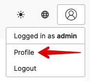

# @4lch4/Docusaurus-Plugin-Umami

This repo is home to a Docusaurus plugin that is my fork of the [`docusaurus-plugin-umami` plugin][0] by [PatelN123][1]. It enables you to use [Umami analytics][2] on a [Docusaurus site][3].

## Usage

To use the plugin you must first install it, which you can do by running one of the following commands:

```bash
# npm
npm i @4lch4/docusaurus-plugin-umami

# pnpm
pnpm i @4lch4/docusaurus-plugin-umami

# yarn
yarn add @4lch4/docusaurus-plugin-umami
```

Once you have it installed, you'll need to configure it. To do this, open your [`docusaurus.config.js`][4] file and add a `umami` object to the [`themeConfig`][5] like so:

```js
// docusaurus.config.js
module.exports = {
  plugins: ['@4lch4/docusaurus-plugin-umami'],
  themeConfig: {
    umami: {
      websiteId: 'websiteId', // Instructions below on how to find this
      src: 'script src', // Instructions below on how to find this
    },
  },
}
```

### Getting the Website Id and Script Src

1. Log into your instance of Umami.
2. In the top right, click on your profile picture and select "Profile".
   - 
   - 
3. Click on "Websites" in the left sidebar.
   - 
4. For the website you want to track, click on the "Tracking Code" button.
   - 
5. The `data-website-id` property is what you want for the `websiteId` field and the `src` property is what you want for the `src` field.
   - 

[0]: https://github.com/PatelN123/docusaurus-plugin-umami
[1]: https://github.com/PatelN123
[2]: https://umami.is
[3]: https://docusaurus.io
[4]: https://docusaurus.io/docs/api/docusaurus-config
[5]: https://docusaurus.io/docs/api/docusaurus-config#themeConfig
